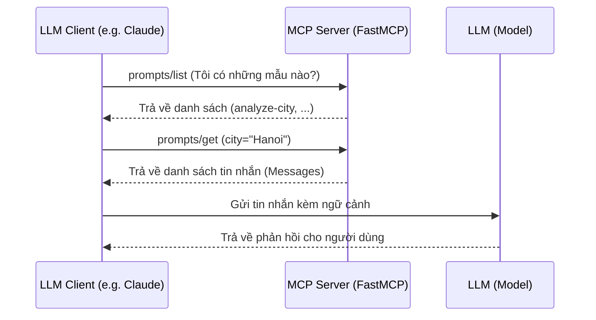
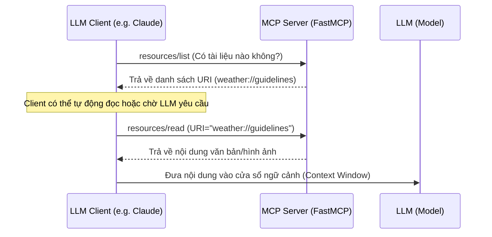
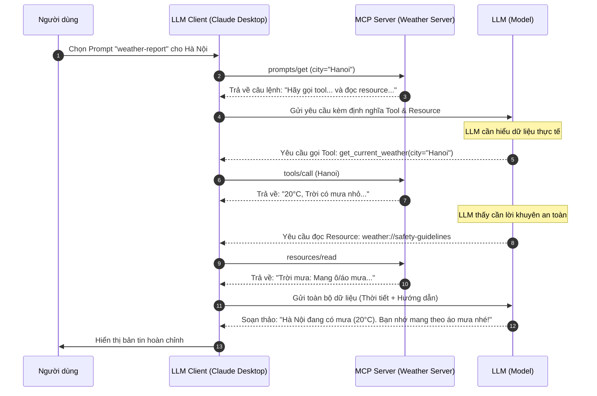

# Giới thiệu chi tiết về FastMCP

FastMCP là một framework Python cấp cao, được thiết kế để đơn giản hóa quá trình xây dựng các server tuân thủ giao thức **Model Context Protocol (MCP)**. Được phát triển bởi Jonathon Lowin (tác giả của Prefect), FastMCP giúp kết nối các Mô hình Ngôn ngữ Lớn (LLM) với dữ liệu và chức năng của bạn một cách nhanh chóng và an toàn.

## 1. Các Tính Năng Cốt Lõi

### 🛠 Tools (Công cụ)

Tools là các hàm Python mà LLM có thể gọi để thực hiện hành động hoặc lấy dữ liệu.

- **Dễ sử dụng:** Chỉ cần thêm decorator `@mcp.tool()`.
- **Tự động hóa:** FastMCP tự động tạo JSON Schema cho các đối số dựa trên Type Hints (gợi ý kiểu) và Docstrings.
- **Hỗ trợ Async/Sync:** Bạn có thể viết code đồng bộ hoặc bất đồng bộ tùy ý.

```python
@mcp.tool()
def calculate_sum(a: int, b: int) -> int:
    """Cộng hai số lại với nhau."""
    return a + b
```

### 📂 Resources (Tài nguyên)

Resources cung cấp dữ liệu cho AI mà AI không thể tác động (chế độ chỉ đọc).

- **Cách viết:** Dùng decorator `@mcp.resource("uri://path")`.
- **Ví dụ thực tế:** Cung cấp tài liệu hướng dẫn, quy định công ty, hoặc dữ liệu cảm biến.

```python
@mcp.resource("weather://guidelines")
def get_weather_safety() -> str:
    """Trả về hướng dẫn an toàn thời tiết."""
    return "1. Luôn mang theo ô. 2. Tránh trú mưa dưới gốc cây."
```

### 📝 Prompts (Gợi ý mẫu)

Prompts giúp AI biết nó cần làm gì khi bắt đầu một chu trình làm việc. Bạn có thể truyền tham số vào prompt tương tự như một hàm Python.

- **Cách viết:** Dùng decorator `@mcp.prompt("name")`.
- **Ví dụ thực tế:** Tạo một prompt chuẩn để phân tích dữ liệu thị trường hoặc chẩn đoán lỗi hệ thống.

```python
@mcp.prompt("analyze-city")
def analyze_city_prompt(city: str) -> str:
    return f"Hãy phân tích thời tiết tại {city} và tư vấn trang phục phù hợp."
```

## 2. Trải Nghiệm Phát Triển (DX) Cực Tốt

### 🔍 Built-in Inspector

Đây là một trong những tính năng "đắt giá" nhất. Khi chạy lệnh `mcp dev server.py`, FastMCP sẽ:

- Khởi tạo một giao diện Web cục bộ.
- Cho phép bạn test các Tool, Resource và Prompt ngay trên trình duyệt mà chưa cần kết nối với AI thực tế.
- Tự động reload khi bạn thay đổi code.

### 🛡 Type Safety & Validation

- Tích hợp chặt chẽ với **Pydantic**.
- Tự động kiểm tra dữ liệu đầu vào từ LLM, đảm bảo code của bạn không bị crash do dữ liệu sai định dạng.

### 🖼 Multimedia & Complex Types

FastMCP không chỉ giới hạn ở văn bản. Bạn có thể dễ dàng trả về:

- **Hình ảnh:** (PNG, JPEG).
- **Video & Audio:** Hỗ trợ đa phương tiện giúp các agent AI trở nên mạnh mẽ hơn.

## 3. Luồng tương tác giữa Client và Server

Đây là phần quan trọng nhất để hiểu cách các thành phần này hoạt động trong thực tế. Giao thức MCP sử dụng **JSON-RPC** để trao đổi thông tin giữa Client và Server.

### 🔄 Luồng làm việc của Prompts

Prompts thường được dùng để **bắt đầu** hoặc **định hướng** một cuộc hội thoại.



### 📦 Luồng làm việc của Resources

Resources cung cấp **ngữ cảnh nền** (Context) mà AI có thể truy cập để tham khảo (Read-only).



## 4. Sự khác biệt then chốt về mặt tương tác

| Thành phần    | Ai bắt đầu?           | Vai trò                | Tác động đến LLM                               |
| :------------ | :-------------------- | :--------------------- | :--------------------------------------------- |
| **Tools**     | **LLM**               | Thực hiện hành động    | LLM tự gọi Tool khi cần xử lý dữ liệu          |
| **Resources** | **Client/LLM**        | Cung cấp thông tin nền | Cung cấp dữ liệu để LLM tham khảo (Read-only)  |
| **Prompts**   | **Người dùng/Client** | Định hình câu lệnh     | Thiết lập cấu trúc/mục tiêu cho cuộc hội thoại |

## 5. Khả Năng Linh Hoạt về Transport

FastMCP hỗ trợ hai phương thức truyền tải chính:

1. **Stdio:** Dành cho các ứng dụng chạy cục bộ (như Claude Desktop).
2. **SSE (Server-Sent Events):** Dành cho các server chạy trên cloud, cho phép kết nối qua HTTP.

## 6. Progress Reporting (Báo cáo tiến độ)

Cho phép các tool thông báo tiến độ thực hiện (ví dụ: "Đang tải 50%...") giúp người dùng không cảm thấy phải chờ đợi quá lâu mà không biết chuyện gì đang xảy ra.

## 7. Case Study: "Hành trình thực thi bản tin thời tiết"

Đây là luồng thực tế khi một AI Assistant (như Claude) sử dụng MCP Server của bạn để trả lời yêu cầu: **"Hãy lập báo cáo thời tiết cho Hà Nội"**.



### Tại sao lại cần cả 3 thành phần?

- **Prompt**: Giúp chuẩn hóa cách AI tiếp cận vấn đề (luôn tìm dữ liệu rồi mới tìm lời khuyên).
- **Tool**: Cung cấp **dữ liệu động** (thời gian thực) từ thế giới bên ngoài.
- **Resource**: Cung cấp **tri thức tĩnh** hoặc dữ liệu tham khảo (quy trình, hướng dẫn) mà AI cần tuân thủ.

---

**Kết luận:** FastMCP là lựa chọn hàng đầu nếu bạn muốn xây dựng MCP server bằng Python nhờ vào cú pháp Pythonic, tính năng Inspector mạnh mẽ và khả năng xử lý kiểu dữ liệu thông minh.
